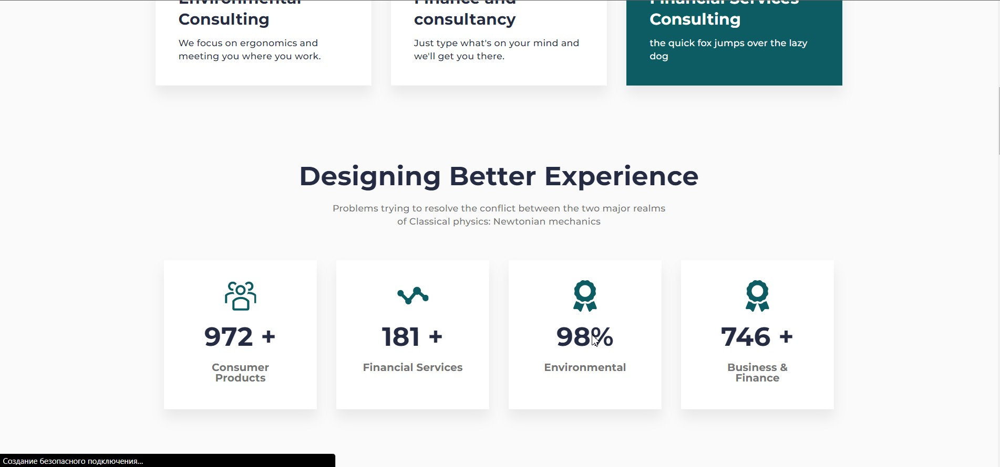
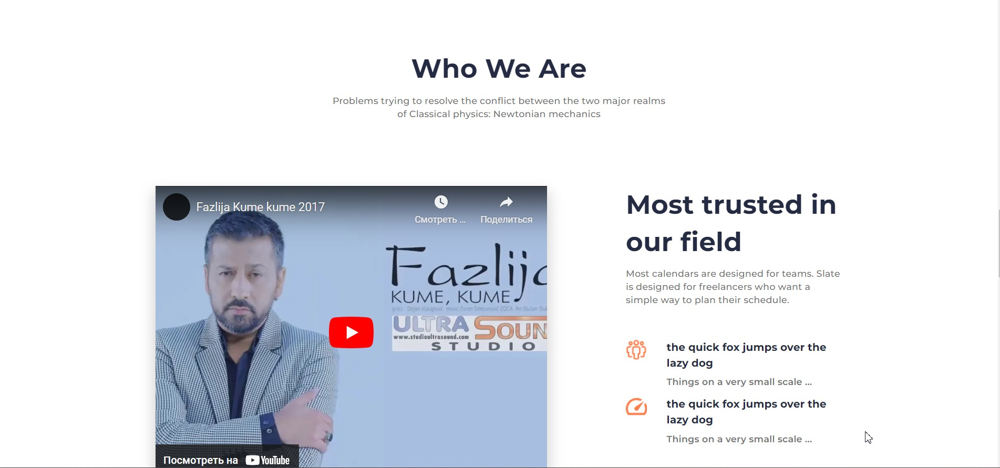

# Relvice

### [Простой сайт для отработки вёрстки](https://gor241.github.io/Relvice/)

## Screenshots:
 | 
--- | ---
 | 

## Функциональность:
- отработка БЕМ
- адаптивные картинки и блоки
- элементарная вёрстка

## Планы по странице:
- добавить функционал и логику
